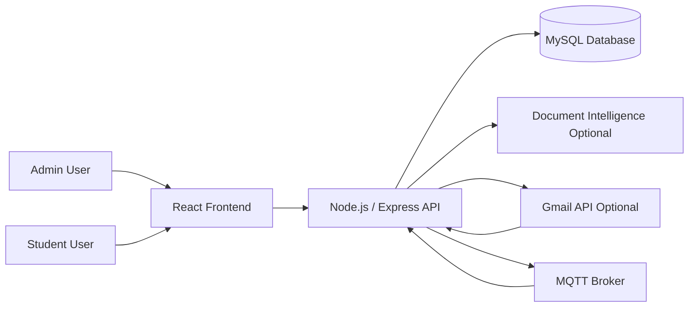
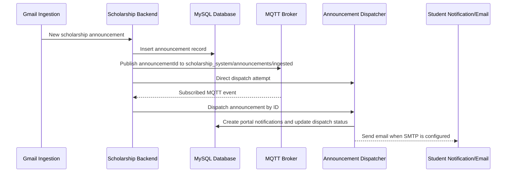
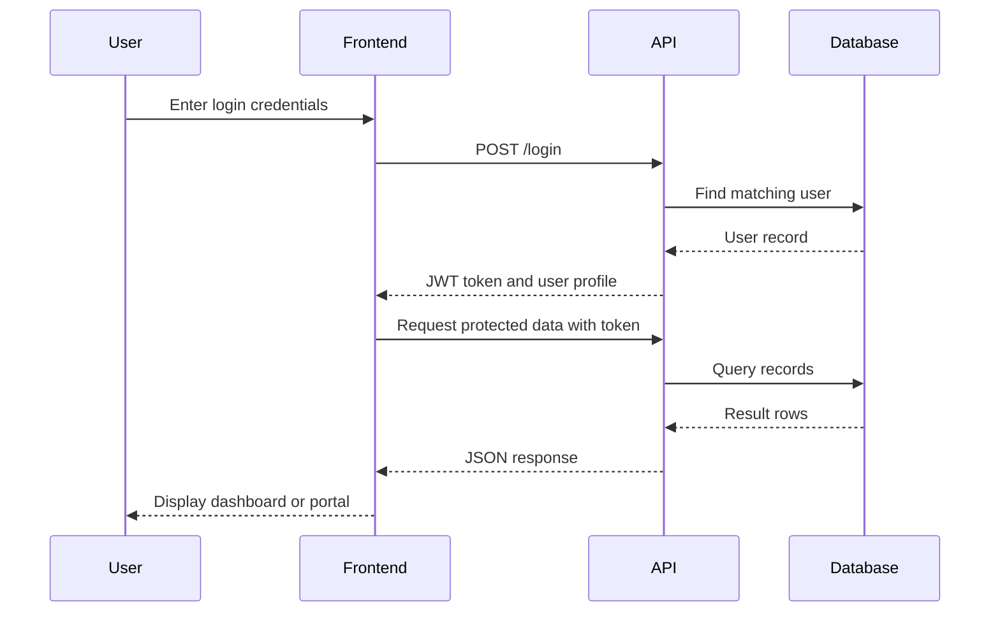
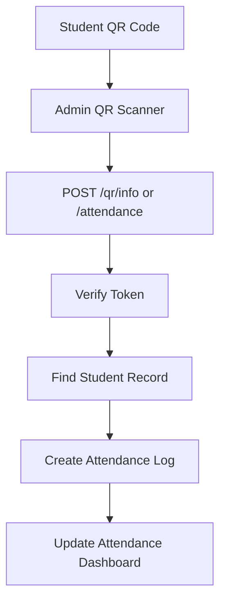

# MQTT-Implemented Scholarship Tracking System

Student Grantee Management, QR Attendance Monitoring, Document Scanning, Forecasting, and Real-Time Announcement Event Delivery via MQTT

System Documentation

Date:
June 2026

Submitted by:
Scholarship System Development Team

Submitted for:
Project Instructor / Evaluator

Academic Year 2026-2027

---

## System Description

The MQTT-Implemented Scholarship Tracking System is a web-based scholarship management platform designed to help administrators manage TES and TDP grantees, monitor attendance through QR scanning, process scholarship documents, deliver announcements, and provide students with a dedicated portal for viewing their scholarship information. The system implements MQTT as an event-delivery layer for scholarship announcement ingestion and dispatch workflows.

The system is composed of three main layers:

- A React frontend that provides the admin dashboard and student portal.
- A Node.js and Express backend that handles authentication, records, attendance, document scanning, analytics, announcements, and API routing.
- A MySQL database that stores users, students, scholarship programs, attendance logs, forecasts, notifications, announcements, and MQTT logs.
- An MQTT client that connects to a broker, publishes scholarship announcement ingestion events, and subscribes to the same event topic for real-time dispatch handling.

The platform supports two major user groups: administrators and students. Administrators can manage grantee records, scan QR codes for attendance, review dashboards, analyze documents, monitor scholarship risk forecasts, and send or sync announcements. Students can log in to their own portal to view profile details, attendance history, scholarship details, notifications, QR code information, and settings.

The MQTT implementation allows the backend to publish an event whenever a new scholarship announcement is ingested. The backend also subscribes to the configured MQTT topic and triggers announcement dispatch when a valid event is received. This design supports a publish-subscribe workflow where announcement ingestion and announcement delivery can be connected through a broker instead of relying only on direct function calls or scheduled polling.

## Statement of the Problem

Scholarship offices commonly rely on spreadsheets, manual attendance sheets, scattered document submissions, and separate communication channels. These methods make it difficult to track grantee status, verify attendance, monitor student risk, and keep students updated in a timely and organized way.

Specifically, this system addresses the following problems:

- Manual grantee tracking can lead to duplicate records, outdated information, and slow retrieval of student data.
- Attendance monitoring through paper-based methods is time-consuming and vulnerable to encoding errors.
- Scholarship document checking is difficult when student IDs or grantee data must be verified manually.
- Administrators lack a centralized dashboard for TES and TDP scholarship statistics.
- Students have limited access to their own scholarship status, attendance history, and announcements.
- Scholarship announcements may be missed when communication is handled through disconnected channels without event-based delivery.
- Risk monitoring is harder without forecasting tools that combine attendance and academic indicators.

## Objectives

The main objective of this project is to develop a centralized Scholarship Tracking System for managing TES and TDP grantees, attendance, documents, analytics, forecasts, and student portal access.

Specifically, the system aims to:

- Provide secure login access for administrators and students.
- Allow administrators to create, update, view, and delete grantee records.
- Generate and scan student QR codes for attendance monitoring.
- Store attendance logs with date, time, semester, academic year, status, scan type, and device information.
- Provide dashboard metrics for total grantees, scholarship distribution, attendance monitoring, and status summaries.
- Support document scanning and spreadsheet import for student ID matching and bulk grantee import.
- Provide risk forecasting based on GPA and attendance rate.
- Deliver student notifications and scholarship announcements through database records, email dispatch, server-sent events, and MQTT announcement events.
- Provide a student portal where grantees can view their profile, attendance, QR code, documents, scholarship details, forecasts, notifications, and settings.
- Implement MQTT publish-subscribe messaging for scholarship announcement ingestion and dispatch events.
- Support Gmail and document intelligence integrations for expanded automation when credentials are configured.

## User Roles and Access

The system implements role-based access using JSON Web Tokens. Each user account has a role stored in the database, and protected backend routes require a valid token.

| Role | Access Method | Key Permissions |
| --- | --- | --- |
| Admin | Staff login using email and password | Manage grantees, view dashboards, scan QR attendance, analyze documents, import students, view analytics, review forecasts, manage announcements, and monitor notifications |
| Student | Student portal login using email or student ID | View personal profile, scholarship details, attendance history, student QR code, notifications, forecast page, documents requirements, and account settings |

Students may log in using a full email address or a student ID. When a student ID is entered without an email domain, the backend converts it to a local scholarship login format.

## System Features

### Authentication and Session Management

- Users log in through the frontend login screen.
- The backend validates credentials against the `users` table.
- Passwords may be checked using bcrypt hashes or plain text for existing seeded test accounts.
- Successful login returns a JWT token with the user ID, role, and student ID.
- The frontend stores the token and user data in local storage for session persistence.
- Axios attaches the token to protected API requests.

### Admin Dashboard

- Displays high-level scholarship metrics for monitoring grantee activity.
- Shows student counts, scholarship status distribution, monthly distribution, monitoring statistics, and online presence.
- Provides a central entry point for grantee management, QR scanning, forecasting, analytics, notifications, and document scanning.

### Grantee Management

- Administrators can add grantees to the system.
- Grantee records include student ID, award number, name, sex, birthdate, email, contact number, address, guardian information, course, year level, semester, academic year, scholarship type, status, QR code, and scholarship program.
- The supported scholarship types are TES and TDP.
- Scholarship status may be Active, Pending, Suspended, or Graduated.
- Records are stored in the `students` table and linked to scholarship programs where applicable.

### QR Attendance Monitoring

- Each student can have a QR code used for attendance scanning.
- Administrators scan a QR code from the QR Scanner page.
- Attendance is recorded through the `/attendance` API endpoint.
- Attendance logs include the student ID, attendance date, time in, semester, academic year, status, scan type, MQTT status, device information, and timestamp.
- A uniqueness rule prevents duplicate attendance entries for the same student on the same date.

### Student Portal

- Students are routed to the student dashboard after login.
- The portal includes profile viewing, scholarship information, QR code access, attendance history, notifications, forecast page, document requirements, and settings.
- Students can update profile information and change their password.
- Student announcements are available through a protected student announcement endpoint.

### Document Scanning and Bulk Import

- Administrators can upload spreadsheet, PDF, or image files for document analysis.
- Excel and CSV files are parsed directly using the `xlsx` package.
- PDF and image files require the document intelligence integration to be configured.
- The system extracts possible student IDs and checks them against the database.
- Results are grouped into matched and unmatched students.
- Bulk import can create new student records and automatically generate student login accounts.

### Forecasting and Risk Monitoring

- Administrators can view scholarship risk forecasts through the Forecast page.
- Forecast data is stored in the `forecasts` table.
- Risk levels include SAFE, WARNING, and AT RISK.
- Forecast records include student ID, GPA, attendance rate, risk level, and prediction date.
- The `/predict` endpoint supports risk prediction workflows.

### Notifications and Announcements

- Notifications are stored per student with title, message, risk level, category, read status, and creation time.
- Scholarship announcements may be created manually or ingested from Gmail when configured.
- Admins can list announcements, trigger Gmail sync, and receive announcement stream updates.
- Pending announcements are dispatched by a scheduled backend sweep.
- MQTT is implemented as the event messaging layer for announcement ingestion.
- When a new Gmail announcement is inserted, the backend publishes an MQTT message to the announcement ingestion topic.
- The backend subscribes to the same topic and dispatches the referenced announcement when a valid `announcementId` is received.
- MQTT messages use QoS 1 so each announcement event is delivered at least once.

### MQTT Event Messaging

- MQTT support is implemented in `backend/src/services/mqttClient.js`.
- MQTT starts when `MQTT_ENABLED=true` is set in the backend environment.
- The backend connects using `MQTT_URL` or a generated URL from `MQTT_HOST` and `MQTT_PORT`.
- The default topic base is `scholarship_system`.
- The active announcement event topic is `scholarship_system/announcements/ingested`.
- Published payloads include `announcementId`, `source`, and an ISO timestamp.
- The MQTT subscriber parses each JSON payload and triggers announcement dispatch for the matching announcement record.
- Connection resiliency is handled through MQTT reconnect behavior with a reconnect period of 2 seconds.

### Analytics

- The Analytics page supports visual review of scholarship data.
- Dashboard routes expose monthly distribution, status distribution, monitoring statistics, and online student presence.
- Frontend charting uses Chart.js, React Chart.js, and Recharts.

## System Architecture Design

The MQTT-Implemented Scholarship Tracking System uses a client-server architecture with an MQTT publish-subscribe messaging layer for real-time announcement event delivery.



### MQTT Publish-Subscribe Flow



### Application Flow



### Attendance Flow



## Database Design

The database is named `scholarship_system`. The main schema is located in `database/scheme.sql`.

| Table | Purpose |
| --- | --- |
| `users` | Stores admin and student login accounts |
| `scholarship_programs` | Stores scholarship programs such as TES and TDP |
| `students` | Stores grantee profile and scholarship information |
| `attendance_logs` | Stores QR and manual attendance records |
| `forecasts` | Stores GPA, attendance rate, and risk-level predictions |
| `notifications` | Stores student notifications |
| `scholarship_announcements` | Stores manual or Gmail-ingested announcements |
| `mqtt_logs` | Stores MQTT topic, payload, and status logs |

Important database constraints include:

- `users.email` must be unique.
- `students.student_id` must be unique.
- `students.award_number` must be unique when provided.
- `attendance_logs` prevents duplicate student attendance for the same date.
- Attendance, forecast, and notification tables reference student records.

## Backend API Overview

The backend runs on port `5000` by default and exposes REST endpoints through Express.

| Endpoint | Method | Purpose |
| --- | --- | --- |
| `/health` | GET | Check backend health |
| `/register` | POST | Register an admin or student account |
| `/login` | POST | Authenticate a user and return a token |
| `/student/me` | GET | Get the logged-in student's profile |
| `/student/me` | PUT | Update the logged-in student's profile |
| `/student/change-password` | PUT | Change student password |
| `/student/announcements` | GET | Get student announcements |
| `/students` | GET | List grantee records |
| `/students` | POST | Add a grantee |
| `/students/:id` | PUT | Update a grantee |
| `/students/:id` | DELETE | Delete a grantee |
| `/attendance` | POST | Record attendance |
| `/attendance/stats/today` | GET | Get today's attendance statistics |
| `/attendance/logs` | GET | Get attendance logs |
| `/grantees/stats` | GET | Get grantee attendance statistics |
| `/qr/info` | POST | Get QR-related student information |
| `/dashboard/stats` | GET | Get dashboard statistics |
| `/dashboard/monthly-distribution` | GET | Get monthly chart data |
| `/dashboard/status-distribution` | GET | Get scholarship status chart data |
| `/dashboard/monitoring-stats` | GET | Get monitoring metrics |
| `/dashboard/presence/heartbeat` | POST | Update student online presence |
| `/dashboard/online-now` | GET | Get current online users |
| `/forecast` | GET | List forecast records |
| `/predict` | POST | Run risk prediction |
| `/documents/analyze` | POST | Analyze uploaded document or spreadsheet |
| `/documents/bulk-import` | POST | Import matched student data |
| `/admin/announcements` | GET | List admin announcements |
| `/admin/announcements/gmail-sync` | POST | Trigger Gmail announcement sync |
| `/admin/announcements/stream` | GET | Stream announcement updates |

## MQTT Implementation Details

The system implements MQTT in the backend to support event-driven scholarship announcement delivery. MQTT is used as a lightweight publish-subscribe protocol between the announcement ingestion workflow and the announcement dispatch workflow.

### MQTT Client Configuration

The backend MQTT client is initialized from `backend/src/server.js` when MQTT is enabled. The client connection is managed by `backend/src/services/mqttClient.js`.

| Setting | Purpose | Default / Example |
| --- | --- | --- |
| `MQTT_ENABLED` | Enables or disables MQTT startup | `true` |
| `MQTT_URL` | Full broker URL, if preferred | `mqtt://127.0.0.1:1883` |
| `MQTT_HOST` | Broker host when `MQTT_URL` is not provided | `127.0.0.1` |
| `MQTT_PORT` | Broker port when `MQTT_URL` is not provided | `1883` |
| `MQTT_USERNAME` | Broker username, if authentication is required | Broker-specific |
| `MQTT_PASSWORD` | Broker password, if authentication is required | Broker-specific |
| `MQTT_CLIENT_ID` | Client identifier | Auto-generated if blank |
| `MQTT_TOPIC_BASE` | Base topic namespace | `scholarship_system` |

### MQTT Topic

| Topic | Direction | QoS | Purpose |
| --- | --- | --- | --- |
| `scholarship_system/announcements/ingested` | Publish and Subscribe | 1 | Broadcasts that a scholarship announcement was ingested and should be dispatched |

### MQTT Payload

The MQTT payload is a JSON object:

```json
{
  "announcementId": 1,
  "source": "gmail",
  "ts": "2026-06-02T00:00:00.000Z"
}
```

The `announcementId` identifies the record in the `scholarship_announcements` table. The backend subscriber validates this ID and calls the announcement dispatcher.

### MQTT Processing Logic

1. Gmail ingestion inserts a new record into `scholarship_announcements`.
2. The backend emits an in-process announcement event for the admin dashboard stream.
3. The backend attempts direct dispatch through the announcement dispatcher.
4. The backend publishes an MQTT event to `scholarship_system/announcements/ingested`.
5. The MQTT subscriber receives the event from the broker.
6. The subscriber extracts the `announcementId`.
7. The dispatcher creates portal notifications and sends emails when SMTP is configured.
8. Dispatch status is saved back to the announcement record.

## Frontend Pages

The frontend is a React application served on port `3000` by default.

| Page / Component | Main Function |
| --- | --- |
| Login | Authenticates admin and student users |
| Dashboard | Displays admin summary metrics |
| Grantee Dashboard | Manages student grantee records |
| Admin Document Scan | Uploads and analyzes scholarship documents |
| QR Scanner | Scans student QR codes for attendance |
| Forecast | Displays risk prediction information |
| Notifications | Shows admin notifications and announcements |
| Analytics | Displays scholarship charts and summaries |
| Student Portal | Hosts student-facing pages |
| Student Dashboard | Shows student overview |
| Student Profile | Displays and updates profile information |
| Scholarship Details | Shows scholarship data |
| Attendance History | Displays student attendance records |
| Student QR Code | Shows student QR code |
| Student Notifications | Shows student notifications |
| Documents Requirements | Shows document-related student requirements |
| Student Settings | Handles account settings |

## Procedures

### For Administrators

Admin workflow:

Login -> Review Dashboard -> Manage Grantees -> Scan Attendance -> Review Forecasts and Announcements

1. Open the frontend in a browser.
2. Use the staff login page.
3. Enter the administrator email and password.
4. After login, review the dashboard metrics.
5. Open the grantee dashboard to add, update, or delete student records.
6. Open the QR Scanner page to scan student attendance.
7. Open the Document Scan page to analyze spreadsheets, PDFs, or images.
8. Use the Forecast page to review student risk levels.
9. Use the Notifications or Announcements page to review scholarship updates.
10. Log out after completing administrative tasks.

### For Students

Student workflow:

Login -> View Portal Dashboard -> Check Scholarship Details -> Monitor Attendance and Notifications

1. Open the frontend in a browser.
2. Enter the student email or student ID and password.
3. After login, the system routes the user to the student portal.
4. Review profile details and scholarship information.
5. Open Attendance History to monitor attendance records.
6. Open Student QR Code when QR identification is needed.
7. Review notifications and announcements.
8. Use Settings to update account information when needed.

## Installation and Setup

### Prerequisites

- Node.js
- MySQL
- PowerShell or terminal
- Code editor
- Optional: Azure Document Intelligence credentials
- Optional: Gmail OAuth credentials
- MQTT broker access for announcement event delivery

### Database Setup

1. Open MySQL.
2. Run the schema file:

```sql
SOURCE database/scheme.sql;
```

3. Confirm that the `scholarship_system` database and tables are created.

The schema includes sample TES and TDP programs, sample students, a sample admin account, attendance data, forecast data, and notification data.

### Backend Setup

1. Go to the backend folder:

```powershell
cd "c:\Users\PJ\OneDrive\Desktop\scholarship system\backend"
```

2. Install dependencies:

```powershell
npm install
```

3. Create or update `backend/.env`:

```text
PORT=5000
DB_HOST=127.0.0.1
DB_PORT=3306
DB_USER=root
DB_PASSWORD=
DB_NAME=scholarship_system
JWT_SECRET=SECRET123
```

4. Start the backend:

```powershell
npm start
```

5. Confirm the server is running at:

```text
http://localhost:5000/health
```

### Frontend Setup

1. Go to the frontend folder:

```powershell
cd "c:\Users\PJ\OneDrive\Desktop\scholarship system\frontend"
```

2. Install dependencies:

```powershell
npm install
```

3. Create or update `frontend/.env`:

```text
REACT_APP_API_URLS=http://localhost:5000
```

4. Start the frontend:

```powershell
npm start
```

5. Open the application:

```text
http://localhost:3000
```

## Integration and MQTT Setup

### MQTT Broker

The implemented MQTT feature requires an MQTT broker. A local broker such as Mosquitto or a hosted broker may be used.

```text
MQTT_ENABLED=true
MQTT_HOST=127.0.0.1
MQTT_PORT=1883
MQTT_TOPIC_BASE=scholarship_system
```

For authenticated brokers:

```text
MQTT_USERNAME=your_username
MQTT_PASSWORD=your_password
```

For hosted brokers with a full connection string:

```text
MQTT_URL=mqtt://broker.example.com:1883
```

The backend publishes and subscribes to:

```text
scholarship_system/announcements/ingested
```

### Document Intelligence

PDF and image scanning require document intelligence credentials in `backend/.env`.

```text
DOCUMENT_INTELLIGENCE_ENDPOINT=your_endpoint
DOCUMENT_INTELLIGENCE_API_KEY=your_api_key
```

### Gmail Announcement Ingestion

Gmail integration requires OAuth credentials and a refresh token.

```text
GMAIL_OAUTH_CLIENT_ID=your_client_id
GMAIL_OAUTH_CLIENT_SECRET=your_client_secret
GMAIL_REFRESH_TOKEN=your_refresh_token
GMAIL_POLL_CRON=*/5 * * * *
```

When configured, the backend polls Gmail and ingests scholarship-related announcements.

When MQTT is enabled, the backend initializes the MQTT client during server startup, subscribes to announcement ingestion events, and dispatches matching announcements.

## Testing Guide

### Backend Health Test

1. Start MySQL.
2. Start the backend.
3. Open:

```text
http://localhost:5000/health
```

Expected result:

```json
{
  "ok": true
}
```

### Login Test

Use the seeded admin account:

```text
Email: admin@admin.com
Password: password123
```

Expected result:

- The backend returns a successful login response.
- The frontend redirects to the admin dashboard.
- The token and user details are stored in local storage.

### Student Portal Test

Use a seeded student account, for example:

```text
Email: pjong@example.com
Password: password123
```

or use a student ID login where supported.

Expected result:

- The student is routed to the student portal.
- Student profile, scholarship details, and attendance pages are accessible.

### Grantee Management Test

1. Log in as admin.
2. Open the grantee dashboard.
3. Add a new student record.
4. Edit the student record.
5. Delete the test record if it is no longer needed.

Expected result:

- Student data appears in the grantee list.
- Updates persist in the MySQL database.

### Attendance Test

1. Log in as admin.
2. Open the QR scanner.
3. Scan or submit a valid student QR code.
4. Review attendance logs.

Expected result:

- The attendance record is created once per student per date.
- Dashboard attendance statistics update.

### Document Scan Test

1. Log in as admin.
2. Open Admin Document Scan.
3. Upload an Excel or CSV file containing student IDs.
4. Review matched and unmatched results.

Expected result:

- The system identifies student IDs.
- Existing students are marked as matched.
- Unknown IDs are listed as unmatched.

### MQTT Announcement Event Test

1. Start an MQTT broker.
2. Set `MQTT_ENABLED=true` in `backend/.env`.
3. Start the backend.
4. Confirm the backend logs an MQTT connection message.
5. Publish a test payload to the announcement topic:

```json
{
  "announcementId": 1,
  "source": "manual-test",
  "ts": "2026-06-02T00:00:00.000Z"
}
```

6. Review the announcement dispatch status in the admin notifications or announcements page.

Expected result:

- The backend receives the MQTT message from `scholarship_system/announcements/ingested`.
- The matching announcement is processed by the dispatcher.
- Student portal notifications are created.
- Email dispatch runs if SMTP is configured.

### Forecast Test

1. Log in as admin.
2. Open the Forecast page.
3. Review forecast records or submit a prediction request.

Expected result:

- Forecast records show risk levels such as SAFE, WARNING, or AT RISK.

## Troubleshooting

| Issue | Possible Cause | Solution |
| --- | --- | --- |
| Backend does not start | MySQL is not running or database settings are incorrect | Start MySQL and verify `backend/.env` |
| Login fails | Wrong credentials or missing user record | Check `users` table and confirm email/password |
| Frontend cannot reach backend | API URL is incorrect | Check `frontend/.env` and backend port |
| Document scan returns 503 | Document Intelligence is not configured | Add endpoint and API key to backend environment |
| Attendance duplicates are rejected | Same student already has attendance for the date | Check `attendance_logs` unique rule |
| Announcements do not sync | Gmail credentials are missing or invalid | Configure Gmail OAuth values |
| MQTT event dispatch does not run | MQTT is disabled, broker is offline, or topic base is incorrect | Set `MQTT_ENABLED=true`, verify broker settings, and use `scholarship_system/announcements/ingested` |
| Student portal shows missing profile | User account has no matching `student_id` | Match `users.student_id` with `students.student_id` |

## Security Considerations

- Protected routes require JWT authentication.
- Admin-only routes use role checks.
- Helmet is enabled for common HTTP security headers.
- Express rate limiting is enabled to reduce abusive traffic.
- Password hashing is supported through bcrypt for registered accounts.
- Environment variables should be used for secrets and integration credentials.
- Production deployments should replace the default `JWT_SECRET`.

## Limitations

- The seeded database contains plain text sample passwords for local testing.
- PDF and image document scanning depend on external document intelligence configuration.
- MQTT workflow runs when `MQTT_ENABLED=true` and a broker is reachable.
- Gmail workflow only runs when the required Gmail credentials are provided.
- The frontend uses local storage for session persistence.
- Risk forecasting depends on available GPA and attendance data.

## Conclusion

The MQTT-Implemented Scholarship Tracking System provides a centralized platform for managing TES and TDP grantees, monitoring QR-based attendance, processing documents, reviewing analytics, forecasting student risk, and supporting student self-service through a portal. By combining administrative tools, student-facing access, and MQTT-based announcement event delivery, the system reduces manual work and improves the visibility of scholarship-related records and communication.
